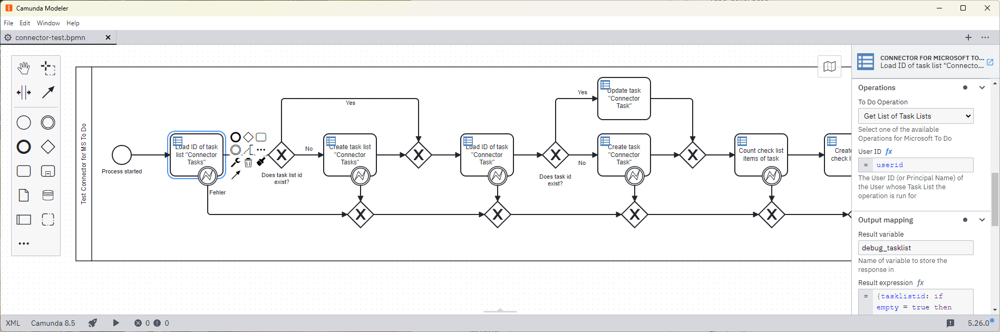

#  Outbound Connector for To Do

This is a custom Camunda 8 outbound connector to read, create, update and delete Task Lists, Tasks and Check List Items in Microsoft 365 To Do. 

It currently supports all operations described below in the section [Operations](#operations). Current restrictions and caveats are described in the section [Restrictions](#restrictions).



## Building the Connector

To build a Connector package, please run the following command:

```bash
mvn clean package
```

This will create two artifacts in the `target` directory:

* `bbht-outbound-connector-microsoft-todo-${version}-with-dependencies.jar`
  This is a JAR file with all dependencies (except the Camunda Connector SDK, which are in scope `provided` and will be brought along by the respective Connector Runtime executing the Connector) which are potentially shaded to avoid classpath conflicts.
* `bbht-outbound-connector-microsoft-todo-${version}.jar`
  This is a plain JAR file without the required dependencies.

## Connector Configuration in Office 365

To be able to use the Connector, please create an App Registration with Client Secret Credentials and set the following API Permissions for the Connector to work properly:

* `Directory.Read.All`
* `Users.ReadBasic.All`
* `Tasks.ReadWrite.All`

For authentication, you will later on need the Tenant ID, the Client ID and the Client Secret. These are best persisted as Managed Secrets in your Camunda Cluster (see [Manage secrets](https://docs.camunda.io/docs/components/console/manage-clusters/manage-secrets/) for additional information).

## Installing the Connector Template

Besides installing the Connector in your Camunda Cluster (refer to the Camunda documentation for additional information), the Connector template has to be provided for either your Web or Desktop Modeler. This procedure is described in [Providing and using Connector templates](https://docs.camunda.io/docs/components/connectors/custom-built-connectors/connector-templates/#providing-and-using-connector-templates) in the Camunda Documentation.
The template is named `connector-for-microsoft-to-do.json` and can be found in the `element-template` folder of the source package.

## Testing the Connector locally

In the directory `local-test` we provide a Docker Compose file to test the Connector locally.
The file `local-test/README.md` contains all information required to run test the Connector in your
local environment. 

## <a id="operations"></a> Operations

The To Do Connector currently supports the following methods from the MS Graph API 1.0. For authentication, currently only the Client Secret Authentication method is supported.

* [Get List of Task Lists](#op_list_task_lists)
* [Get Task List](#op_get_task_list)
* [Create Task List](#op_create_task_list)
* [Update Task List](#op_update_task_list)
* [Delete Task List](#op_delete_task_list)

* [Get List of Tasks](#op_list_tasks)
* [Get Task](#op_get_task)
* [Create Task](#op_create_task)
* [Update Task](#op_update_task)
* [Delete Task](#op_delete_task)

* [Get List of Check List Items](#op_list_task_lists)
* [Get Check List Item](#op_get_task_list)
* [Create Check List Item](#op_create_task_list)
* [Update Check List Item](#op_update_task_list)
* [Delete Check List Item](#op_delete_task_list)

All operations use the following common parameters:

| Parameter | Type | Description |
|:---|:---|:---|
| Tenant ID | string (Secret) | The Microsoft 365 Tenant ID |
| Client ID | string (Secret) | The Microsoft 365 Client ID |
| Client Secret | string (Secret) | The Microsoft 365 Client Secret |
| User ID | string | The User ID or Principal Name (can be the email address) of the users whose To Do items are operated on |

All operations return a common result wrapper for their output which has the following format: 

```json
{
    "result": <result-type-described-for-each-operation>,
    "empty": boolean,
    "error": {
        "errorCode": string,
        "errorMessage": string
    }
}
``` 

`result` contains the result of the operation if it was successful and returns a result. It will have the format described for each operation below and may be `null` otherwise.
`empty` is `true` whenever an operation returns no result, an empty result (e.g. an empty array) or an error message and `false` in any other case.
`error` is not `null` whenever an exception occured within the depths of the Connector. Then, the `errorMessage` field will contains the exception message. If the exception was explicitly thrown by the Microsoft Graph API, then the HTTP status code will be set in the `errorCode` field.

<a id="datetimetimezone"></a> **DateTimeTimeZone**

Some operations may contain fields of the type `DateTimeTimeZone`, which is described here.

| Attribute | Type | Description |
|:---|:---|:---|
| dateTime | string | The Date and Time in the format `YYYY-MM-DD'T'hh:mm:ss.SSSSSS` (note that the hyphens around the 'T' are only for better readibility). |
| timeZone | string | A timezone that is valid for Windows. In the Camunda Modeler, a selection of values is already given. |


### <a id="op_list_task_lists"></a> Get List of Task Lists

This operation gets a list of all Task Lists for the given user.

#### Input

*No additional parameters.*

#### Output

The result is an array with 0..n entries of the following type:

| Attribute | Type | Description |
|:----|:----|:----|
| id | string | Unique ID of the task list | 
| displayName | string | The displayed name of the task list |
| owner | boolean | `true` if given user is the owner of the given task list, else `false` |
| shared | boolean | `true` if the given task list is shared with other users, else `false` |
| wellknownListName | enum | Property indicating the list name if the given list is a well-known list. Possible values are: `NONE`, `DEFAULT_LIST`, `FLAGGED_EMAILS`, `UNKNOWN_FUTURE_VALUE` |

```json
[
    {
        "id": string,
        "displayName": string,
        "owner": boolean,
        "shared": boolean,
        "wellknownListName": string-with-enum
    },{
        "id": string,
        "displayName": string,
        "owner": boolean,
        "shared": boolean,
        "wellknownListName": string-with-enum
    },
    ...
]
```

### <a id="op_get_task_list"></a> Get Task List

This operation gets a single Task List for the given user.

#### Input

| Parameter | Type | Optional? | Description |
|:---|:---|:---|:---|
| Task List ID | string | no | The unique ID of the Task List to be loaded. |

#### Output

The result is one or none object of the following type:

| Attribute | Type | Description |
|:----|:----|:----|
| id | string | Unique ID of the task list | 
| displayName | string | The displayed name of the task list |
| owner | boolean | `true` if given user is the owner of the given task list, else `false` |
| shared | boolean | `true` if the given task list is shared with other users, else `false` |
| wellknownListName | enum | Property indicating the list name if the given list is a well-known list. Possible values are: `NONE`, `DEFAULT_LIST`, `FLAGGED_EMAILS`, `UNKNOWN_FUTURE_VALUE` |

```json
{
    "id": string,
    "displayName": string,
    "owner": boolean,
    "shared": boolean,
    "wellknownListName": string-with-enum
}
```

### <a id="op_create_task_list"></a> Create Task List

This operation creates a new Task List for the given user.

#### Input

| Parameter | Type | Optional? | Description |
|:---|:---|:---|:---|
| Display Name | string | no | The displayed name of the task list |

#### Output

The result is one or none of the following type:

| Attribute | Type | Description |
|:----|:----|:----|
| id | string | Unique ID of the task list | 
| displayName | string | The displayed name of the task list |
| owner | boolean | `true` if given user is the owner of the given task list, else `false` |
| shared | boolean | `true` if the given task list is shared with other users, else `false` |
| wellknownListName | enum | Property indicating the list name if the given list is a well-known list. Possible values are: `NONE`, `DEFAULT_LIST`, `FLAGGED_EMAILS`, `UNKNOWN_FUTURE_VALUE` |

```json
{
    "id": string,
    "displayName": string,
    "owner": boolean,
    "shared": boolean,
    "wellknownListName": string-with-enum
}
```

### <a id="op_update_task_list"></a> Update Task List

This operation updates an existing Task List of the given user.

#### Input

| Parameter | Type | Optional? | Description |
|:---|:---|:---|:---|
| Task List ID | string | no | The unique ID of the task list to be updated |
| Display Name | string | yes[*](#note1) | The displayed name of the task list |

<a id="note1"></a>* **Note:** *If this field is left empty, the update operation will not change it.*

#### Output

The result is one or none of the following type:

| Attribute | Type | Description |
|:----|:----|:----|
| id | string | Unique ID of the task list | 
| displayName | string | The displayed name of the task list |
| owner | boolean | `true` if given user is the owner of the given task list, else `false` |
| shared | boolean | `true` if the given task list is shared with other users, else `false` |
| wellknownListName | enum | Property indicating the list name if the given list is a well-known list. Possible values are: `NONE`, `DEFAULT_LIST`, `FLAGGED_EMAILS`, `UNKNOWN_FUTURE_VALUE` |

```json
{
    "id": string,
    "displayName": string,
    "owner": boolean,
    "shared": boolean,
    "wellknownListName": string-with-enum
}
```

### <a id="op_delete_task_list"></a> Delete Task List

This operation deletes an existing Task List of the given user.

#### Input

| Parameter | Type | Optional? | Description |
|:---|:---|:---|:---|
| Task List ID | string | no | The unique ID of the task list to be updated |

#### Output

*The operation does not return a result object.*

### <a id="op_list_tasks"></a> Get List of Tasks

This operation gets a list of all Tasks in a Task List for the given user.

#### Input

| Parameter | Type | Optional? | Description
|:---|:---|:---|:---|
| Task List ID | string | no | The unique ID of the task list of

#### Output

The result is an array with 0..n entries of the following type:

| Attribute | Type | Description |
|:----|:----|:----|
| id | string | Unique ID of the task  | 
| title | string | The title of the task |
| body | string | The body of the task (currently only Plain-Text is supported) |
| bodyLastModifiedDateTime | string | The date and time the body was last modified. Has the format `YYYY-MM-DD'T'hh:mm:ss.SSSSSS{timezone}`, where timezone can be `Z` for UTC or `+hh:mm` or `-hh:mm` |
| categories | string[] | An array of categories of this task |
| completedDateTime | [DateTimeTimeZone](#datetimetimezone) | The date and time the task was completed. |
| createdDateTime | string | The date and time the task was created. Has the format `YYYY-MM-DD'T'hh:mm:ss.SSSSSS{timezone}`, where timezone can be `Z` for UTC or `+hh:mm` or `-hh:mm` |
| dueDateTime | [DateTimeTimeZone](#datetimetimezone) | The date and time the task is due. |
| importance | enum | The importance of the task. Possible values are `HIGH`, `NORMAL` or `LOW`. |
| lastModifiedDateTime | string | The date and time the task was last modified. Has the format `YYYY-MM-DD'T'hh:mm:ss.SSSSSS{timezone}`, where timezone can be `Z` for UTC or `+hh:mm` or `-hh:mm` |
| startDateTime | [DateTimeTimeZone](#datetimetimezone) | The date and time the task was started. |
| status | enum | The status of the task. Possible values are `NOT_STARTED`, `IN_PROGRESS`, `COMPLETED`, `WAITING_ON_OTHERS`, `DEFERRED`. |

```json
[
    {
        "id": string,
        "title": string,
        "body": string,
        "bodyLastModifiedDateTime": string,
        "categories": string[],
        "completedDateTime": {
            "dateTime": string,
            "timeZone": string
        },
        "createdDateTime": string,
        "dueDateTime": {
            "dateTime": string,
            "timeZone": string
        },
        "importance": string-with-enum,
        "lastModifiedDateTime": string,
        "startDateTime": {
            "dateTime": string,
            "timeZone": string
        },
        "status": string-with-enum
    },
    {
        "id": string,
        "title": string,
        "body": string,
        "bodyLastModifiedDateTime": offsetDateTime,
        "categories": string[],
        "completedDateTime": {
            "dateTime": string,
            "timeZone": string
        },
        "createdDateTime": timestamp,
        "dueDateTime": {
            "dateTime": string,
            "timeZone": string
        },
        "importance": string-with-enum,
        "lastModifiedDateTime": offsetDateTime,
        "startDateTime": {
            "dateTime": string,
            "timeZone": string
        },
        "status": string-with-enum
    },
    ...

```

### <a id="op_get_task"></a> Get Task

This operation gets a single Task in a Task List for the given user.

#### Input

| Parameter | Type | Optional? | Description
|:---|:---|:---|:---|
| Task List ID | string | no | The unique ID of the task list |
| Task ID | string | no | The unique ID of the task to be loaded |

#### Output

The result is one or none object of the following type:

| Attribute | Type | Description |
|:----|:----|:----|
| id | string | Unique ID of the task  | 
| title | string | The title of the task |
| body | string | The body of the task (currently only Plain-Text is supported) |
| bodyLastModifiedDateTime | string | The date and time the body was last modified. Has the format `YYYY-MM-DD'T'hh:mm:ss.SSSSSS{timezone}`, where timezone can be `Z` for UTC or `+hh:mm` or `-hh:mm` |
| categories | string[] | An array of categories of this task |
| completedDateTime | [DateTimeTimeZone](#datetimetimezone) | The date and time the task was completed. |
| createdDateTime | string | The date and time the task was created. Has the format `YYYY-MM-DD'T'hh:mm:ss.SSSSSS{timezone}`, where timezone can be `Z` for UTC or `+hh:mm` or `-hh:mm` |
| dueDateTime | [DateTimeTimeZone](#datetimetimezone) | The date and time the task is due. |
| importance | enum | The importance of the task. Possible values are `HIGH`, `NORMAL` or `LOW`. |
| lastModifiedDateTime | string | The date and time the task was last modified. Has the format `YYYY-MM-DD'T'hh:mm:ss.SSSSSS{timezone}`, where timezone can be `Z` for UTC or `+hh:mm` or `-hh:mm` |
| startDateTime | [DateTimeTimeZone](#datetimetimezone) | The date and time the task was started. |
| status | enum | The status of the task. Possible values are `NOT_STARTED`, `IN_PROGRESS`, `COMPLETED`, `WAITING_ON_OTHERS`, `DEFERRED`. |

```json
{
    "id": string,
    "title": string,
    "body": string,
    "bodyLastModifiedDateTime": string,
    "categories": string[],
    "completedDateTime": {
        "dateTime": string,
        "timeZone": string
    },
    "createdDateTime": string,
    "dueDateTime": {
        "dateTime": string,
        "timeZone": string
    },
    "importance": string-with-enum,
    "lastModifiedDateTime": string,
    "startDateTime": {
        "dateTime": string,
        "timeZone": string
    },
    "status": string-with-enum
}
```
### <a id="op_create_task"></a> Create Task

This operation creates a new Task in a Task List of the given user.

#### Input

| Parameter | Type | Optional? | Description
|:---|:---|:---|:---|
| Task List ID | string | no | The unique ID of the task list |
| Title | string | no | The title of the task |
| Body | string | no | The body of the task (currently only Plain-Text is supported) |
| Categories | string | yes | Comma-separated list of categories for the task |
| Importance | enum | no | The importance of the task |
| Status | enum | no | The current status of the task |
| Start Date & Time | string | yes | Timestamp containing date and time the task was started. Has the format `YYYY-MM-DD'T'hh:mm:ss.SSSSSS` (without the hyphens around the T).
| Start Date & Time Time Zone | enum | yes | Time Zone of the start date. |
| Due Date & Time | string | yes | Timestamp containing date and time the task is due. Has the format `YYYY-MM-DD'T'hh:mm:ss.SSSSSS` (without the hyphens around the T).
| Due Date & Time Time Zone | enum | yes | Time Zone of the due date. |
| Completed Date & Time | string | yes | Timestamp containing date and time the task was completed. Has the format `YYYY-MM-DD'T'hh:mm:ss.SSSSSS` (without the hyphens around the T).
| Completed Date & Time Time Zone | enum | yes | Time Zone of the completion date. |

#### Output

The result is one or none object of the following type:

| Attribute | Type | Description |
|:----|:----|:----|
| id | string | Unique ID of the task  | 
| title | string | The title of the task |
| body | string | The body of the task (currently only Plain-Text is supported) |
| bodyLastModifiedDateTime | string | The date and time the body was last modified. Has the format `YYYY-MM-DD'T'hh:mm:ss.SSSSSS{timezone}`, where timezone can be `Z` for UTC or `+hh:mm` or `-hh:mm` |
| categories | string[] | An array of categories of this task |
| completedDateTime | [DateTimeTimeZone](#datetimetimezone) | The date and time the task was completed. |
| createdDateTime | string | The date and time the task was created. Has the format `YYYY-MM-DD'T'hh:mm:ss.SSSSSS{timezone}`, where timezone can be `Z` for UTC or `+hh:mm` or `-hh:mm` |
| dueDateTime | [DateTimeTimeZone](#datetimetimezone) | The date and time the task is due. |
| importance | enum | The importance of the task. Possible values are `HIGH`, `NORMAL` or `LOW`. |
| lastModifiedDateTime | string | The date and time the task was last modified. Has the format `YYYY-MM-DD'T'hh:mm:ss.SSSSSS{timezone}`, where timezone can be `Z` for UTC or `+hh:mm` or `-hh:mm` |
| startDateTime | [DateTimeTimeZone](#datetimetimezone) | The date and time the task was started. |
| status | enum | The status of the task. Possible values are `NOT_STARTED`, `IN_PROGRESS`, `COMPLETED`, `WAITING_ON_OTHERS`, `DEFERRED`. |

```json
{
    "id": string,
    "title": string,
    "body": string,
    "bodyLastModifiedDateTime": string,
    "categories": string[],
    "completedDateTime": {
        "dateTime": string,
        "timeZone": string
    },
    "createdDateTime": string,
    "dueDateTime": {
        "dateTime": string,
        "timeZone": string
    },
    "importance": string-with-enum,
    "lastModifiedDateTime": string,
    "startDateTime": {
        "dateTime": string,
        "timeZone": string
    },
    "status": string-with-enum
}
```

### <a id="op_update_task"></a> Update Task

This operation updates a new Task in a Task List of the given user.

#### Input

| Parameter | Type | Optional? | Description
|:---|:---|:---|:---|
| Task List ID | string | no | The unique ID of the task list |
| Task  ID | string | no | The unique ID of the task to be updated |
| Title | string | yes[*](#note2) | The title of the task |
| Body | string | yes[*](#note2) | The body of the task (currently only Plain-Text is supported) |
| Categories | string | yes[*](#note2) | Comma-separated list of categories for the task |
| Importance | enum | yes[*](#note2) | The importance of the task |
| Status | enum | yes[*](#note2) | The current status of the task |
| Start Date & Time | string | yes[*](#note2) | Timestamp containing date and time the task was started. Has the format `YYYY-MM-DD'T'hh:mm:ss.SSSSSS` (without the hyphens around the T).
| Start Date & Time Time Zone | enum | yes[*](#note2) | Time Zone of the start date. |
| Due Date & Time | string | yes[*](#note2) | Timestamp containing date and time the task is due. Has the format `YYYY-MM-DD'T'hh:mm:ss.SSSSSS` (without the hyphens around the T).
| Due Date & Time Time Zone | enum | yes[*](#note2) | Time Zone of the due date. |
| Completed Date & Time | string | yes[*](#note2) | Timestamp containing date and time the task was completed. Has the format `YYYY-MM-DD'T'hh:mm:ss.SSSSSS` (without the hyphens around the T).
| Completed Date & Time Time Zone | enum | yes[*](#note2) | Time Zone of the completion date. |

<a id="note2"></a>* **Note:** *If this field is left empty, the update operation will not change it.*

#### Output

The result is one or none object of the following type:

| Attribute | Type | Description |
|:----|:----|:----|
| id | string | Unique ID of the task  | 
| title | string | The title of the task |
| body | string | The body of the task (currently only Plain-Text is supported) |
| bodyLastModifiedDateTime | string | The date and time the body was last modified. Has the format `YYYY-MM-DD'T'hh:mm:ss.SSSSSS{timezone}`, where timezone can be `Z` for UTC or `+hh:mm` or `-hh:mm` |
| categories | string[] | An array of categories of this task |
| completedDateTime | [DateTimeTimeZone](#datetimetimezone) | The date and time the task was completed. |
| createdDateTime | string | The date and time the task was created. Has the format `YYYY-MM-DD'T'hh:mm:ss.SSSSSS{timezone}`, where timezone can be `Z` for UTC or `+hh:mm` or `-hh:mm` |
| dueDateTime | [DateTimeTimeZone](#datetimetimezone) | The date and time the task is due. |
| importance | enum | The importance of the task. Possible values are `HIGH`, `NORMAL` or `LOW`. |
| lastModifiedDateTime | string | The date and time the task was last modified. Has the format `YYYY-MM-DD'T'hh:mm:ss.SSSSSS{timezone}`, where timezone can be `Z` for UTC or `+hh:mm` or `-hh:mm` |
| startDateTime | [DateTimeTimeZone](#datetimetimezone) | The date and time the task was started. |
| status | enum | The status of the task. Possible values are `NOT_STARTED`, `IN_PROGRESS`, `COMPLETED`, `WAITING_ON_OTHERS`, `DEFERRED`. |

```json
{
    "id": string,
    "title": string,
    "body": string,
    "bodyLastModifiedDateTime": string,
    "categories": string[],
    "completedDateTime": {
        "dateTime": string,
        "timeZone": string
    },
    "createdDateTime": string,
    "dueDateTime": {
        "dateTime": string,
        "timeZone": string
    },
    "importance": string-with-enum,
    "lastModifiedDateTime": string,
    "startDateTime": {
        "dateTime": string,
        "timeZone": string
    },
    "status": string-with-enum
}
```

### <a id="op_delete_task"></a> Delete Task

This operation deletes an existing Task in a Task List of the given user.

#### Input

| Parameter | Type | Optional? | Description |
|:---|:---|:---|:---|
| Task List ID | string | no | The unique ID of the task list that contains the task to be deleted |
| Task ID | string | no | The unique ID of the task to be deleted |

#### Output

*The operation does not return a result object.*

### <a id="op_list_check_list_items"></a> Get List of Check List Items

This operation gets a list of all Check List Items in a Task of a Task List for the given user.

#### Input

| Parameter | Type | Optional? | Description
|:---|:---|:---|:---|
| Task List ID | string | no | The unique ID of the task list |
| Task ID | string | no | The unique ID of the task |

#### Output

The result is an array with 0..n entries of the following type:

| Attribute | Type | Description |
|:----|:----|:----|
| id | string | Unique ID of the check list item | 
| checked | boolean | `true` if the check list item has be crossed off, else `false` |
| displayName | string | The displayed name of the check list item |
| checkedDateTime | string | The date and time the task was checked. Has the format `YYYY-MM-DD'T'hh:mm:ss.SSSSSS{timezone}`, where timezone can be `Z` for UTC or `+hh:mm` or `-hh:mm` |
| createdDateTime | string | The date and time the task was created. Has the format `YYYY-MM-DD'T'hh:mm:ss.SSSSSS{timezone}`, where timezone can be `Z` for UTC or `+hh:mm` or `-hh:mm` |

```json
[
    {
        "id": string,
        "checked": boolean,
        "displayName": string,
        "checkedDateTime": timestamp,
        "createdDateTime": timestamp
    }, {
        "id": string,
        "checked": boolean,
        "displayName": string,
        "checkedDateTime": timestamp,
        "createdDateTime": timestamp
    }, 
    ...
]
```

### <a id="op_get_check_list_item"></a> Get Check List Item

This operation get a Check List Item in a Task of a Task List for the given user.

#### Input

| Parameter | Type | Optional? | Description
|:---|:---|:---|:---|
| Task List ID | string | no | The unique ID of the task list |
| Task ID | string | no | The unique ID of the task |
| Check List Item ID | string | no | The unique ID of the check list item to load |

#### Output

The result is one or none object of the following type:

| Attribute | Type | Description |
|:----|:----|:----|
| id | string | Unique ID of the check list item | 
| checked | boolean | `true` if the check list item has be crossed off, else `false` |
| displayName | string | The displayed name of the check list item |
| checkedDateTime | string | The date and time the task was checked. Has the format `YYYY-MM-DD'T'hh:mm:ss.SSSSSS{timezone}`, where timezone can be `Z` for UTC or `+hh:mm` or `-hh:mm` |
| createdDateTime | string | The date and time the task was created. Has the format `YYYY-MM-DD'T'hh:mm:ss.SSSSSS{timezone}`, where timezone can be `Z` for UTC or `+hh:mm` or `-hh:mm` |

```json
{
    "id": string,
    "checked": boolean,
    "displayName": string,
    "checkedDateTime": timestamp,
    "createdDateTime": timestamp
}
```

### <a id="op_create_check_list_item"></a> Create Check List Item

This operation creates a new Check List Item in a Task of a Task List of the given user.

#### Input

| Parameter | Type | Optional? | Description
|:---|:---|:---|:---|
| Task List ID | string | no | The unique ID of the task list |
| Task ID | string | no | The unique ID of the task |
| Display Name | string | no | The displayed name of the check list item |
| Checked | boolean | no | Select if the check list item is to be crossed off, else do not select |

#### Output

The result is one or none object of the following type:

| Attribute | Type | Description |
|:----|:----|:----|
| id | string | Unique ID of the check list item | 
| checked | boolean | `true` if the check list item has be crossed off, else `false` |
| displayName | string | The displayed name of the check list item |
| checkedDateTime | string | The date and time the task was checked. Has the format `YYYY-MM-DD'T'hh:mm:ss.SSSSSS{timezone}`, where timezone can be `Z` for UTC or `+hh:mm` or `-hh:mm` |
| createdDateTime | string | The date and time the task was created. Has the format `YYYY-MM-DD'T'hh:mm:ss.SSSSSS{timezone}`, where timezone can be `Z` for UTC or `+hh:mm` or `-hh:mm` |

```json
{
    "id": string,
    "checked": boolean,
    "displayName": string,
    "checkedDateTime": timestamp,
    "createdDateTime": timestamp
}
```

### <a id="op_update_check_list_item"></a> Update Check List Item

This operation updated a new Check List Item in a Task of a Task List of the given user.

#### Input

| Parameter | Type | Optional? | Description
|:---|:---|:---|:---|
| Task List ID | string | no | The unique ID of the task list |
| Task ID | string | no | The unique ID of the task |
| Display Name | string | yes[*](#note3) | The displayed name of the check list item |
| Checked | boolean | yes[*](#note3) | Select if the check list item is to be crossed off, else do not select |

<a id="note3"></a>* **Note:** *If this field is left empty, the update operation will not change it.*

#### Output

The result is one or none object of the following type:

| Attribute | Type | Description |
|:----|:----|:----|
| id | string | Unique ID of the check list item | 
| checked | boolean | `true` if the check list item has be crossed off, else `false` |
| displayName | string | The displayed name of the check list item |
| checkedDateTime | string | The date and time the task was checked. Has the format `YYYY-MM-DD'T'hh:mm:ss.SSSSSS{timezone}`, where timezone can be `Z` for UTC or `+hh:mm` or `-hh:mm` |
| createdDateTime | string | The date and time the task was created. Has the format `YYYY-MM-DD'T'hh:mm:ss.SSSSSS{timezone}`, where timezone can be `Z` for UTC or `+hh:mm` or `-hh:mm` |

```json
{
    "id": string,
    "checked": boolean,
    "displayName": string,
    "checkedDateTime": timestamp,
    "createdDateTime": timestamp
}
```


### <a id="op_delete_check_list_item"></a> Delete Check List Item

This operation deletes an existing Check List Item in a Task of a Task List of the given user.

#### Input

| Parameter | Type | Optional? | Description |
|:---|:---|:---|:---|
| Task List ID | string | no | The unique ID of the task list containing the task of the check list item to be deleted |
| Task ID | string | no | The unique ID of the task that contains the check list item to be deleted |
| Check List Item ID | string | no | The unique ID of the check list item to be deleted |

#### Output

*The operation does not return a result object.*

## Usage Hints

### Using secrets

Camunda 8 allows you to manage secrets within your cluster. The Connector uses the following default
values for the Client Authentication secrets to prevent those from being readable:

* `{{secrets.TENANT_ID}}` for the Tenant ID
* `{{secrets.CLIENT_ID}}` for the Client ID
* `{{secrets.CLIENT_SECRET}}` for the Client Secret

**We highly recommend to use those secrets in your Camunda installation.**

You can find more information on secret management in the [Camunda Documentation](https://docs.camunda.io/docs/components/console/manage-clusters/manage-secrets/).

### Filtering for a specific items

To filter a for specific item, you can use *Result expressions* such as the following:

**Filtering for a task list with a specific display name and either returning its id or `null`:**
  ```java
  {
    tasklistid: 
      if empty = true 
      then null 
      else result[item.displayName = "<filter-criterion>"][1].id
  }
  ```

### Evaluating the result for possible errors

To check if an error occurred, you can use an *Error Expression* similar to the following one. This one will return a BPMN Error (with either a given or an empty error code) if the error return value was not null.

```java
if error != null then
  bpmnError(if error.errorCode != null then error.errorCode else "", error.errorMessage)
else 
  null
```

## <a id="restrictions"></a> Restrictions

The following restrictions currently apply:

* Task Lists, Tasks and Check List Items cannot be loaded recursively (e.g. loading all check list items in all tasks of a given task list). 
* Also, currently no additional relationships (such as `extensions`, `attachments` and `linkedResources`) are supported.
* For Tasks, the properties `isReminderOn`, `reminderDateTime` and `recurrence` are not yet supported (c.f. [https://learn.microsoft.com/en-us/graph/api/resources/todotask](https://learn.microsoft.com/en-us/graph/api/resources/todotask?view=graph-rest-1.0))

## Disclaimer

*This product is not affiliated with Microsoft Corporation. 'To Do' and 'Office 365' are trademarks of 
Microsoft Corporation. 'Connector for To Do' provides access to Microsoft's 'To Do' service, but does not claim 
ownership or affiliation with Microsoft or its products.*