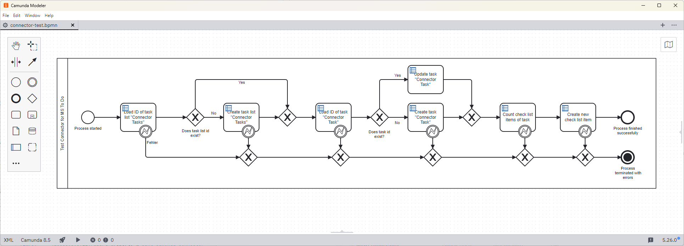
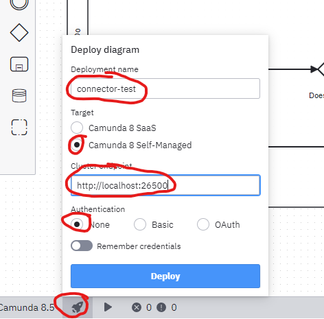
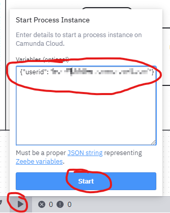
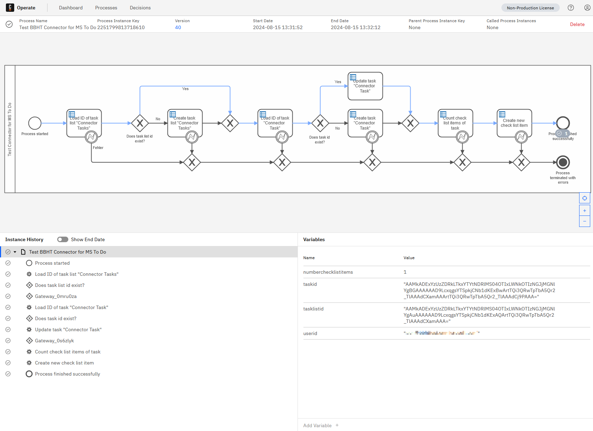

# Local test environment

The files provided in this directory allow the start of a local Camunda 8 environment
and deployment as well as execution of a test process for the Microsoft To Do Connector.

## Necessary tools

The following is required for execution:
* a current [Podman](https://podman.io/) or [./docker](https://www../docker.com/) virtualization environment and
* the [Camunda Desktop Modeler](https://camunda.com/de/download/modeler/) in a version that supports Camunda 8.5

## Configuration of the connector secrets

**ATTENTION: The file `connector-secrets.txt` must not be committed under any circumstances. 🔥**
To configure the connector secrets, the file
`connector-secrets.txt` must be created manually with the following content
must be created manually with the following content.

```
# add secrets per line in the format NAME=VALUE
# WARNING: ensure not to commit changes to this file
TENANT_ID=
CLIENT_ID=
CLIENT_SECRET=
```

The three fields must then be filled with the correct values for the
Microsoft 365 tenant.

## Configuration of the local environment

To be able to use the BBHT Connector, the project must first be built (e.g. using `mvn clean verify`).
Then copy the file `${project.dir}/target/bbht-outbound-connector-microsoft-todo-${version}-with-dependencies.jar` into the directory
`local-test` directory.
In order for the connector to be used in the Camunda Desktop Modeler, the file
`$[project.dir}/element-templates/connector-for-microsoft-to-do.json` for use in process models
must be copied.
Under Windows, the file must be copied to the directory `${modeler.basedir}/resources/element-templates`; under
MacOS to the directory `${user.home}/.camunda/element-templates`.

## Starting the Camunda engine

⚠️ Execute the following commands in the `local-test` subdirectory.⚠️

### Podman

To run via Podman, execute the following command:

```shell
podman compose --env-file ./docker-compose.env -f ./docker-compose.yaml up
```

On MacOS there may be problems with the start, then execute the following command instead:

```shell
./docker-compose --env-file ./docker-compose.env -f ./docker-compose.yaml --userns=keep-id:uid={$UID} up
```


### ./docker

The following command must be executed to run ./docker:

```shell
./docker-compose --env-file ./docker-compose.env -f ./docker-compose.yaml up
```

## Logins

The login data for local development is

* Username: `demo`
* Password: `demo`

### Camunda Operate

The local development instance of *Camunda Operate* can be accessed via the
URL [http://localhost:8081/](http://localhost:8081/).

### Camunda Tasklist

The local development instance of *Camunda Tasklist* can be accessed via the
URL [http://localhost:8082/](http://localhost:8082/).

### Zeebe Engine

The *Zeebe Engine* is available at [http://localhost:26500/](http://localhost:26500/).


## Deploy and execute the process

To deploy and execute the process, the file `local-test/connector-test.bpmn` must first be opened in the
Camunda Desktop Modeler must be opened.



The process must first be deployed in the Camunda engine. To do this, click on the rocket symbol at the bottom and
select the following options:

* `Deployment name`: `connector-test`
* `Target`: `Camunda 8 Self-Managed`
* `Cluster endpoint`: `http://localhost:26500`
* `Authentication`: `None`




Then start the deployment with “Deploy”. After a short time, the following message should appear


The process can now be started. To do this, click on the playback icon at the bottom and enter the following
Add the following variable definition:

```json
{ “userid”: “email@tenant.onmicrosoft.com” }
```



Now execute the process via “Start”. This should also be acknowledged with a message:


Now log in to [Camunda Operate](http://localhost:8081) (login: `demo`/`demo`). Switch to the Process view
select the process “Test BBHT Connector for MS To Do”, enter “All Version” for Versions
and click on all options (both `Running Instances` and `Finished Instances`) in the filters:


Then select a process and check whether it has run correctly


